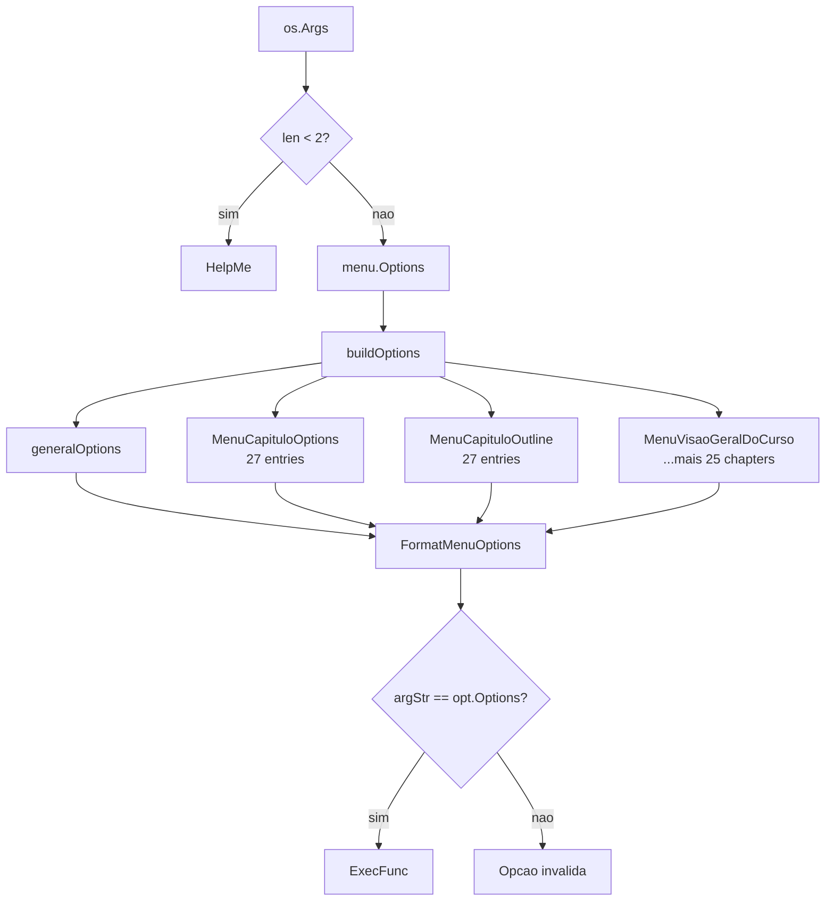

# Plano de Modernização: aprendago

## Migração para cobra-cli + SOLID — Capítulo por Capítulo

---

## Sumário

1. [Estado Atual](#1-estado-atual)
2. [Objetivos](#2-objetivos)
3. [Formato de Conteúdo: YAML vs Markdown](#3-formato-de-conteudo-yaml-vs-markdown)
4. [Arquitetura Alvo](#4-arquitetura-alvo)
5. [Estratégia de Migração por Capítulo](#5-estrategia-de-migracao-por-capitulo)
6. [Plano Detalhado por Fase](#6-plano-detalhado-por-fase)
7. [Prova de Conceito: Capítulo 1](#7-prova-de-conceito-capitulo-1)
8. [Calendário Sugerido](#8-calendario-sugerido)
9. [Riscos e Mitigações](#9-riscos-e-mitigacoes)

---

## 1. Estado Atual

### Estrutura do Projeto

```
cmd/aprendago/main.go
  → os.Args manual (if len < 2)
  → menu.Options(args)
      → buildOptions(args, 30+ slices de MenuOptions)
          → FormatMenuOptions(args, allOptions)
              → strings.Join(args, " ") == hardcoded string → exec func()

internal/
  chapter/
    chapter.go            → slice fixo de 27 funcoes
  menu/
    options.go            → entry point do CLI, 30+ imports
    helpme.go             → help header manual
    capitulo_options.go   → 27 entries hardcoded (--cap=N --topics)
    capitulo_outline.go   → 27 entries hardcoded (--cap=N --overview)
  <chapter>/
    overview.yml          → conteudo do capitulo
    topics.go             → Topics(), MenuX(), HelpMeX()
    menu.go               → Menu(args)
    help.go               → Help()
    static_content.go     → const rootDir, flags, descs
    constants.go          → variaveis
    examples.go           → exemplos de codigo
    resolution_exercises.go → resolucao de exercicios
    *_test.go             → testes

pkg/
  format/                 → 4+ responsabilidades (menu, help, section, questionnaire)
  section/                → SectionProvider, Section.Format()
  topic/                  → Contents, ContentsProvider
  base_content/           → BaseContent (tentativa de reuso)
  reader/                 → leitura de YAML
  logger/                 → logging
  output/                 → formatacao de output
  trim/                   → string trimming
```

### Problemas Identificados

| # | Problema | Localização | Severidade |
|---|---|---|---|
| P1 | Parsing manual de argumentos (`strings.Join` + `==`) | `pkg/format/menu_options.go` | Alta |
| P2 | 30+ imports concretos no `menu/options.go` | `internal/menu/options.go` | Alta |
| P3 | Adicionar capítulo = editar 5+ arquivos | `chapter.go`, `menu/options.go`, `capitulo_options.go`, `capitulo_outline.go`, `helpme.go` | Alta |
| P4 | `pkg/format` acumula 4+ responsabilidades | `pkg/format/` | Média |
| P5 | Naming inconsistente (HelpMe vs Help, MenuCapituloOptions vs Menu) | Múltiplos pacotes | Média |
| P6 | Funcoes `ExecFunc func()` sem retorno de erro | Todos os capítulos | Média |
| P7 | Duplicação de boilerplate entre capítulos | 27 capítulos × 4-5 arquivos | Média |
| P8 | `format.FormatSection()` (legado) convive com `section.Section.Format()` | `pkg/format/section.go` + `pkg/section/section.go` | Baixa |

### Diagrama de Fluxo Atual



---

## 2. Objetivos

### 2.1 CLI Moderno (cobra-cli)

| Atual | Alvo |
|---|---|
| `go run cmd/aprendago/main.go --help` | `aprendago --help` (built-in) |
| `--cap=1 --topics` | `aprendago cap 1 topics` |
| `--cap=1 --overview` | `aprendago cap 1 overview` |
| `--caps` | `aprendago caps` |
| `--outline` | `aprendago outline` |
| `--bem-vindo` | `aprendago cap 1 --topic bem-vindo` |
| Sem autocomplete | Cobra autocomplete nativo (`completion`) |

### 2.2 SOLID

- **SRP**: Cada pacote com uma responsabilidade clara
- **OCP**: Novo capítulo = 1 registro no slice, sem editar código existente
- **LSP**: Struct concreto + embedding — todo capítulo se comporta como `Chapter`
- **ISP**: Interfaces não são necessárias quando 90% dos capítulos compartilham a mesma implementação
- **DIP**: Comandos cobra consomem `[]*chapter.Chapter` (struct concreto), cada capítulo carrega seus dados via YAML sem acoplamento ao menu

### 2.3 Conteúdo em Arquivo

Conteúdo de cada capítulo (seções, textos, exemplos) permanece fora do código Go, em arquivos de dados — YAML ou Markdown (ver seção 3).

### 2.4 Migração por Capítulo

Cada capítulo é migrado individualmente, permitindo:
- Entrega contínua sem big-bang
- Capítulo piloto (1) validado antes de migrar os 27
- Rollback de capítulo individual se necessário

---

## 3. Formato de Conteúdo: YAML vs Markdown

### 3.1 Situação Atual

Hoje o conteúdo vive em `internal/<chapter>/overview.yml`:

```yaml
---
description:
  name: "01 - Visao geral do curso"
  sections:
    - title: "Bem-vindo!"
      text: |
        - Bem vindo ao curso!
        - Eu sou...
```

O parser (`pkg/reader`) lê o YAML e o template (`pkg/format/overview.go`) renderiza.

### 3.2 Opções

#### Opção A: YAML (permanecer)

```yaml
name: "01 - Visao geral do curso"
sections:
  - title: "Bem-vindo!"
    text: |
      Conteudo em markdown...
  - title: "Por que Go?"
    text: |
      Mais conteudo...
```

| Prós | Contras |
|---|---|
| Já implementado e funcionando | `text: \|` para multiline é verboso no YAML |
| Tipado nativamente no Go (structs) | Sem preview visual no GitHub |
| Fácil de validar (`yaml.Unmarshal`) | |
| Estrutura simples e consistente | |

#### Opção B: Markdown com Frontmatter (recomendada)

```markdown
---
title: "Bem-vindo!"
order: 1
chapter: 1
---

- Bem vindo ao curso!
- Eu sou...
- Go foi criada por gente foda...
```

| Prós | Contras |
|---|---|
| Preview nativo no GitHub/GitLab | Precisa de parser de frontmatter + markdown |
| Syntax highlighting para blocos de código | Mudança de formato (migração de dados) |
| Edição mais natural para conteúdo didático | |
| Pode ser um arquivo por seção ou um arquivo por capítulo | |
| Ferramentas como `goldmark` + `goldmark-frontmatter` funcionam bem | |

#### Opção C: Híbrido (o melhor dos dois)

Arquivo YAML de metadados + diretório de arquivos Markdown por seção:

```
internal/<chapter>/
  chapter.yml           → metadados (numero, titulo, ordem das secoes)
  sections/
    bem-vindo.md        → conteudo em markdown puro
    porque-go.md
    sucesso.md
```

| Prós | Contras |
|---|---|
| Metadados estruturados (YAML) | Mais arquivos para gerenciar |
| Conteúdo em markdown puro (editável, previewável) | Precisa carregar 2 fontes por capítulo |
| Separação clara entre estrutura e conteúdo | |

### 3.3 Recomendação

**Manter YAML por ora** (Opção A) e evoluir para **YAML + Markdown** (Opção C) como melhoria futura.

**Justificativa**: A migração para cobra-cli + SOLID já é uma mudança significativa na arquitetura do código. Trocar o formato de dados simultaneamente aumenta o risco e o escopo. O YAML atual funciona bem — o gargalo não está no formato do conteúdo, e sim na arquitetura do código Go.

**Futuro**: Uma vez completa a migração arquitetural, cada capítulo pode evoluir independentemente para usar markdown se houver necessidade (ex.: colaboração de conteúdo via PRs com preview).

---

## 4. Arquitetura Alvo

### 4.1 Dependências Externas

| Dependência | Versão Mínima | Finalidade |
|---|---|---|
| `github.com/spf13/cobra` | v1.9.1 | CLI framework |
| `github.com/spf13/pflag` | (vem com cobra) | Flag parsing |
| `gopkg.in/yaml.v3` | v3.0.1 | Já existe no projeto |

### 4.2 Estrutura de Diretórios (Alvo)

```
cmd/
  aprendago/
    main.go           → apenas cobra.Execute()
  root.go             → cobra.Command raiz
  outline.go          → aprendago outline
  caps.go             → aprendago caps
  cap.go              → aprendago cap [1-27]

internal/
  chapter/
    chapter.go        → struct Chapter concreto + metodos
    registry.go       → slice de *Chapter (OCP)
  <chapter>/
    overview.yml      → conteudo (MESMO formato de hoje)
    chapter.go        → func init() que registra chapter.Chapter{...}
    examples.go       → exemplos de codigo (se houver)
    resolution.go     → resolucao de exercicios (se houver)
    *_test.go         → testes

pkg/
  section/            → Section (ja existe, consolidar uso)
  reader/             → leitura de YAML (ja existe)
  format/             → APENAS formatacao de output (templates)
```

### 4.3 Struct Chapter (concreto, sem interface)

```go
// internal/chapter/chapter.go
package chapter

import (
    "fmt"
    "github.com/fabianoflorentino/aprendago/pkg/format"
    "github.com/fabianoflorentino/aprendago/pkg/section"
)

// Chapter representa um capitulo do curso.
// Capítulos atípicos (com exemplos, exercícios interativos, etc.)
// podem usar embedding e sobrescrever métodos específicos.
type Chapter struct {
    Number  int
    Title   string
    RootDir string
}

func (c *Chapter) Overview() error {
    topics, err := c.Topics()
    if err != nil {
        return err
    }
    for _, t := range topics {
        if err := c.ExecTopic(t); err != nil {
            return err
        }
    }
    return nil
}

func (c *Chapter) ExecTopic(topic string) error {
    s, err := section.New(c.RootDir)
    if err != nil {
        return fmt.Errorf("erro ao criar secao: %w", err)
    }
    return s.Format(topic)
}

func (c *Chapter) Topics() ([]string, error) {
    // Le do overview.yml os titulos das secoes
    return readTopicsFromYAML(c.RootDir)
}

func (c *Chapter) HelpMe() []format.HelpMe {
    // Le do overview.yml e monta os HelpMe
    return readHelpFromYAML(c.RootDir)
}
```

### 4.4 Capítulo Típico (registro puro)

Capítulos que só exibem conteúdo do YAML não precisam de arquivo `chapter.go` próprio — apenas do registro no `init()`:

```go
// internal/visao_geral_do_curso/chapter.go
package visao_geral_do_curso

import "github.com/fabianoflorentino/aprendago/internal/chapter"

func init() {
    chapter.Register(&chapter.Chapter{
        Number:  1,
        Title:   "Visão Geral do Curso",
        RootDir: "internal/visao_geral_do_curso",
    })
}
```

Isso é **tudo** que um capítulo padrão precisa. Os métodos `Overview()`, `ExecTopic()`, `Topics()` e `HelpMe()` vêm herdados do struct `Chapter`.

### 4.5 Capítulo Atípico (embedding + override)

Capítulos com comportamento extra (ex.: `aplicações` com exemplos de JSON, `exercícios` com resolução interativa) usam embedding e sobrescrevem só o que muda:

```go
// internal/aplicacoes/chapter.go
package aplicacoes

import (
    "github.com/fabianoflorentino/aprendago/internal/chapter"
    "github.com/fabianoflorentino/aprendago/pkg/format"
)

type Aplicacoes struct {
    chapter.Chapter           // Number, Title, RootDir, Overview, Topics, HelpMe
    examples []string         // só este capítulo tem
}

func init() {
    chapter.Register(&Aplicacoes{
        Chapter: chapter.Chapter{
            Number:  16,
            Title:   "Aplicações",
            RootDir: "internal/aplicacoes",
        },
        examples: []string{"json-marshal", "json-unmarshal", "bcrypt"},
    })
}

// ExecTopic sobrescreve o comportamento padrao para incluir exemplos.
func (a *Aplicacoes) ExecTopic(topic string) error {
    if a.isExample(topic) {
        return a.runExample(topic)  // logica customizada
    }
    return a.Chapter.ExecTopic(topic)  // delega para o padrao
}
```

### 4.6 Registry (OCP)

```go
// internal/chapter/registry.go
package chapter

var registry []*Chapter

func Register(c *Chapter) {
    registry = append(registry, c)
}

func All() []*Chapter {
    return registry
}

func Get(number int) *Chapter {
    for _, c := range registry {
        if c.Number == number {
            return c
        }
    }
    return nil
}
```

Registro feito via `init()` em cada capítulo — sem interface, sem contrato, só dados.

### 4.8 Comandos Cobra

```go
// cmd/root.go
package cmd

import (
    "github.com/spf13/cobra"
    "github.com/fabianoflorentino/aprendago/internal/chapter"
)

var rootCmd = &cobra.Command{
    Use:   "aprendago",
    Short: "CLI para o curso Aprenda Go",
    RunE: func(cmd *cobra.Command, args []string) error {
        return cmd.Help()  // sem argumentos = help
    },
}

func Execute() error {
    return rootCmd.Execute()
}
```

```go
// cmd/caps.go
package cmd

import (
    "fmt"
    "github.com/spf13/cobra"
    "github.com/fabianoflorentino/aprendago/internal/chapter"
)

var capsCmd = &cobra.Command{
    Use:   "caps",
    Short: "Lista todos os capitulos disponiveis",
    RunE: func(cmd *cobra.Command, args []string) error {
        for _, c := range chapter.All() {
            fmt.Printf("  --cap=%d --topics    %s\n", c.Number(), c.Title())
        }
        return nil
    },
}
```

```go
// cmd/cap.go
package cmd

import (
    "fmt"
    "strconv"
    "github.com/spf13/cobra"
    "github.com/fabianoflorentino/aprendago/internal/chapter"
)

var capCmd = &cobra.Command{
    Use:   "cap [numero] [topics|overview]",
    Short: "Acessa um capitulo do curso",
    Args: cobra.MinimumNArgs(1),
    RunE: func(cmd *cobra.Command, args []string) error {
        num, err := strconv.Atoi(args[0])
        if err != nil {
            return fmt.Errorf("numero do capitulo invalido: %s", args[0])
        }

        c := chapter.Get(num)
        if c == nil {
            return fmt.Errorf("capitulo %d nao encontrado", num)
        }

        if len(args) < 2 || args[1] == "overview" {
            return c.Overview()
        }

        return c.ExecTopic(args[1])
    },
}
```

### 4.9 Compatibilidade Retroativa

Os comandos antigos (`--cap=1 --topics`, `--outline`, `--caps`, etc.) **continuam funcionando** durante a migração através de um adaptador:

```go
// cmd/legacy.go
package cmd

var legacyCmd = &cobra.Command{
    Use:    "aprendago",
    Hidden: true,
    RunE: func(cmd *cobra.Command, args []string) error {
        // Mantem o comportamento atual de menu.Options(args)
        menu.Options(args)
        return nil
    },
}
```

Isso garante que enquanto um capítulo não é migrado, ele ainda funciona pelo fluxo antigo.

### Diagrama de Fluxo Alvo

```mermaid
flowchart TD
    A["aprendago [comando]"] --> B[cobra Execute]
    B --> C{Comando?}

    C -->|caps| D[Lista capitulos]
    C -->|outline| E[Outline completo]
    C -->|cap N topics| F[chapter.Get(N)]
    C -->|cap N overview| F
    C -->|cap N topic X| F
    C -->|sem comando| G[Help automatico]

    F --> H{*Chapter existe?}
    H -->|sim| I[ExecTopic / Overview]
    H -->|nao| J[Erro: capitulo nao encontrado]

    I --> K[section.Section.Format]
    K --> L[reader.ReadSection]
    L --> M[overview.yml]
    M --> N[Template → stdout]
```

### 4.10 Melhoria Futura: Rich CLI (Opção C)

Após a migração completa, a experiência de visualização pode ser enriquecida com renderização markdown no terminal:

```go
import "github.com/charmbracelet/glamour"

func (c *Chapter) ExecTopic(topic string) error {
    s, _ := section.New(c.RootDir)
    content, _ := s.Read(topic)            // conteudo markdown do YAML
    rendered, _ := glamour.Render(content, "dark")  // markdown → terminal colorido
    fmt.Println(rendered)
    return nil
}
```

**Por que não agora**: A migração arquitetural (cobra + struct + registry) já é mudança suficiente. Glamour/tui seriam dependências a mais para gerenciar durante a migração. Rich CLI entra como uma *Fase 5 opcional* depois que todo capítulo estiver rodando no novo formato.

Alternativas futuras (discutir depois da migração):

| Ideia | Esforço | Impacto |
|---|---|---|
| Rich CLI (glamour) | Baixo (horas) | Cores e headings no terminal |
| TUI (bubbletea) | Médio (dias) | Navegação interativa com setas |
| Web server local | Alto (dias) | HTML com CSS, links clicáveis

---

## 5. Estrategia de Migracao por Capitulo

### 5.1 Ordem de Migracao

Cada capítulo será migrado individualmente, na ordem do curso (1 a 27).

A migração de cada capítulo consiste em:

1. **Criar `chapter.go`** com `func init() { chapter.Register(&chapter.Chapter{...}) }`
2. **Se atípico**: criar struct com embedding + override de métodos necessários
3. **Manter `overview.yml`** (permanece inalterado)
4. **Manter exemplos/resoluções** (se houver)
5. **Adaptar testes** existentes
6. **Remover** o código legado do capítulo (`topics.go`, `menu.go`, `help.go`, `static_content.go`, etc.)
7. **Remover imports** desnecessários do `menu/options.go`
8. **Verificar** que comandos antigos (`--cap=N --topics`) e novos (`aprendago cap N topics`) funcionam

### 5.2 Estrategia de Testes

| Tipo | Cobertura | Ferramenta |
|---|---|---|
| Testes existentes do capítulo | Manter, adaptar imports | `go test` |
| Testes de integração do CLI | NOVO: testar `aprendago cap 1 topics` | `go test` com `cmdtest` ou exec |
| Testes de compatibilidade | NOVO: testar flag antiga `--cap=1 --topics` | `go test` com exec |

### 5.3 Critérios de Aceitação por Capítulo

- [ ] `aprendago cap N overview` funciona e exibe mesmo conteudo de antes
- [ ] `aprendago cap N topics` funciona e exibe lista de topicos
- [ ] `aprendago cap N --topic X` funciona
- [ ] `--cap=N --topics` (legado) continua funcionando
- [ ] `--cap=N --overview` (legado) continua funcionando
- [ ] `go test ./internal/<chapter>/...` passa
- [ ] Nenhum warning ou erro de linter novo

---

## 6. Plano Detalhado por Fase

### Fase 0: Setup (1 PR)

```
[0.1] Adicionar cobra-cli como dependencia
      go get github.com/spf13/cobra@latest

[0.2] Criar internal/chapter/chapter.go
      → struct Chapter concreto com Overview, ExecTopic, Topics, HelpMe
      → metodos que leem do overview.yml via section.Section

[0.3] Criar internal/chapter/registry.go
      → slice de *Chapter + Register() + All() + Get()

[0.4] Criar cmd/root.go
      → cobra.Command raiz
      → Execute()

[0.5] Criar cmd/legacy.go
      → comando oculto que delega para menu.Options()
      → garante compatibilidade durante migracao

[0.6] Atualizar cmd/aprendago/main.go
      → chamar cmd.Execute() em vez de menu.Options()

[0.7] Atualizar go.mod e verificar build
```

**Arquivos criados**: 4 (`cmd/root.go`, `cmd/caps.go` [esqueleto], `cmd/cap.go` [esqueleto], `internal/chapter/chapter.go`, `internal/chapter/registry.go`)
**Arquivos modificados**: 1 (`cmd/aprendago/main.go`)
**Build**: `go build ./cmd/aprendago/` deve passar
**Testes**: `go test ./...` deve passar (sem regressao)

### Fase 1: Prova de Conceito — Capitulo 1 (1 PR)

```
[1.1] Criar internal/visao_geral_do_curso/chapter.go
      → func init() { chapter.Register(&chapter.Chapter{...}) }
      → ~5 linhas, apenas dados

[1.2] Adaptar cmd/cap.go para usar chapter.Get()
      → implementar RunE completo

[1.3] Adaptar cmd/caps.go para usar chapter.All()
      → implementar RunE completo

[1.4] Adaptar cmd/outline.go
      → implementar RunE que itera chapter.All()

[1.5] Testar:
      - go test ./internal/visao_geral_do_curso/...
      - go run cmd/aprendago/main.go cap 1 overview
      - go run cmd/aprendago/main.go cap 1 bem-vindo
      - go run cmd/aprendago/main.go --cap=1 --overview (legado)
```

**Arquivos criados**: 1 (`internal/visao_geral_do_curso/chapter.go` — 5 linhas)
**Arquivos modificados**: 3 (`cmd/cap.go`, `cmd/caps.go`, `cmd/outline.go`)
**Codigo legado removido**: 0 (ainda funciona em paralelo pelo `legacy.go`)

### Fase 2: Engine de Compatibilidade (1 PR)

```
[2.1] Implementar mecanismo no legacy.go que:
      - Intercepta --cap=N --topics → redireciona para chapter.Get(N)
      - Intercepta --cap=N --overview → redireciona para chapter.Get(N)
      - Para capitulos nao migrados: delega para menu.Options()
      - Para capitulos migrados: usa *Chapter

[2.2] Criar router de compatibilidade em internal/compat/
      - Mapeia flags antigas para *Chapter
      - Fallback para menu.Options() quando capitulo nao migrado
```

### Fase 3: Migracao em Massa (27 PRs, 1 por capitulo)

Cada PR segue o mesmo padrao:

```
Para o capitulo N:

[3.N.0] Verificar se o capitulo e tipico ou atipico
        - Tipico: so YAML + registro basico (~5 min)
        - Atipico (ex.: aplicacoes): struct com embedding (~30 min)

[3.N.1] Criar internal/<chapter>/chapter.go
        - Tipico: func init() { chapter.Register(&chapter.Chapter{...}) }
        - Atipico: struct com embedding + override

[3.N.2] Se existir, adaptar examples.go e resolution.go
[3.N.3] Adaptar testes
[3.N.4] Remover do legado:
        - internal/menu/options.go: remover import + chamada MenuX()
        - internal/menu/capitulo_options.go: remover entry
        - internal/menu/capitulo_outline.go: remover entry
        - internal/chapter/chapter.go: remover do slice (se aplicavel)
[3.N.5] Remover arquivos legados do capitulo:
        - internal/<chapter>/topics.go
        - internal/<chapter>/menu.go (se existir)
        - internal/<chapter>/help.go (se existir)
        - internal/<chapter>/constants.go (se existir)
        - internal/<chapter>/static_content.go (se existir)
[3.N.6] Verificar:
        - go test ./internal/<chapter>/...
        - go run cmd/aprendago/main.go cap N overview
        - go run cmd/aprendago/main.go --cap=N --overview (legado)
```

### Fase 4: Cleanup (1 PR)

```
[4.1] Remover pkg/format/FormatSection() — substituido por section.Section.Format()
[4.2] Remover pkg/format/menu_options.go — substituido por cobra
[4.3] Remover pkg/format/helpme.go — simplificar (nao precisa mais de template)
[4.4] Remover internal/menu/ — todo o pacote se todos capitulos migrados
[4.5] Remover internal/chapter/chapter.go (slice de funcoes) — substituido por registry
[4.6] Remover pkg/base_content/ — substituido pelo struct Chapter
[4.7] Remover pkg/topic/ — substituido pelos metodos de Chapter
[4.8] Simplificar pkg/format para conter apenas templates de output
[4.9] Remover cmd/legacy.go
```

### Fase 5 (Opcional): Rich CLI

Melhoria de experiencia sem mudar arquitetura:

```
[5.1] Adicionar glamour como dependencia (renderizacao markdown no terminal)
[5.2] Atualizar Chapter.ExecTopic() para renderizar markdown em vez de texto puro
[5.3] Adicionar paginacao interna (menos/term env)

Ou, se preferir TUI:

[5.1] Adicionar bubbletea + lipgloss como dependencias
[5.2] Criar cmd/tui.go com o comando aprendago tui
[5.3] Implementar navegacao com setinhas, scroll, busca
```

**Total de PRs estimado**: ~32 (1 setup + 1 POC + 27 capitulos + 1 compat engine + 1 cleanup + 1 rich-cli opcional)

---

## 7. Prova de Conceito: Capitulo 1

### Antes (legado)

**`internal/visao_geral_do_curso/`** — 3 arquivos, 3 responsabilidades:
```
topics.go    → 71 linhas (Topics, Menu, HelpMe, executeSection)
menu.go      → N/A (via topics.go)
help.go      → N/A (via topics.go)
static_content.go → flags e descs
```

### Depois (migrado)

**`internal/visao_geral_do_curso/chapter.go`** — 5 linhas, 0 responsabilidade propria:

```go
package visao_geral_do_curso

import "github.com/fabianoflorentino/aprendago/internal/chapter"

func init() {
    chapter.Register(&chapter.Chapter{
        Number:  1,
        Title:   "Visão Geral do Curso",
        RootDir: "internal/visao_geral_do_curso",
    })
}
```

Todo o comportamento vem do struct `Chapter` em `internal/chapter/chapter.go`.

### Comparativo

| Aspecto | Antes | Depois |
|---|---|---|
| Linhas de codigo no capitulo | ~100 (topics + static_content) | 5 (só registro) |
| Responsabilidades do capitulo | menu + help + exec + flags | nenhuma (dados puros) |
| Comportamento vem de | codigo proprio duplicado | struct Chapter compartilhado |
| Cap. atipico | N/A (cada um faz do seu jeito) | embedding + override |
| Acoplamento com menu | `menu/options.go` importa direto | `chapter.Register()` |
| Retorno de erro | void (erro logado, engolido) | `error` (propagado para o CLI) |
| Adicionar novo capitulo | editar 5+ arquivos | 5 linhas + 1 YAML |

---

## 8. Calendario Sugerido

| Fase | PRs | Esforço | Depende de |
|---|---|---|---|
| Fase 0: Setup | 1 | Pequeno | — |
| Fase 1: POC Cap 1 | 1 | Pequeno | Fase 0 |
| Fase 2: Compat Engine | 1 | Médio | Fase 1 |
| Fase 3: Migração (27 caps) | 27 | 1-2h cada | Fase 2 |
| Fase 4: Cleanup | 1 | Médio | Fase 3 |

**Total**: ~31 PRs, ~3-5 dias de trabalho sequencial, ~1-2 dias com paralelismo.

### Paralelismo

PRs da **Fase 3** podem ser feitos em paralelo por serem independentes entre si (cada capítulo é um PR separado). Sugestão: 3-5 PRs paralelos por batch.

---

## 9. Riscos e Mitigações

| Risco | Probabilidade | Impacto | Mitigação |
|---|---|---|---|
| Quebrar compatibilidade retroativa | Média | Alto | `legacy.go` + testes de compatibilidade em cada PR |
| Capitulo com estrutura atípica (ex.: aplicações com examples.go) | Média | Médio | POC valida o padrão; capítulos atípicos são tratados caso a caso |
| Testes existentes precisarem de refactor | Alta | Baixo | Adaptar testes no mesmo PR do capítulo |
| YAML mudar de formato no meio da migração | Baixa | Alto | Decisão tomada: manter YAML até Fase 4 |
| Atraso em revisão de 31 PRs | Alta | Médio | Usar PRs pequenos e revisão assíncrona |

### Matriz de Compatibilidade

| Comando | Fase 0-1 | Fase 2 | Fase 3 (cap N) | Fase 4 |
|---|---|---|---|---|
| `--help` | ✅ legado | ✅ legado | ✅ legado/cobra | ✅ cobra |
| `--caps` | ✅ legado | ✅ legado | ✅ legado/cobra | ✅ cobra |
| `--outline` | ✅ legado | ✅ legado | ✅ legado/cobra | ✅ cobra |
| `--cap=N --topics` (cap nao migrado) | ✅ legado | ✅ legado | ✅ legado | N/A |
| `--cap=N --topics` (cap migrado) | ✅ legado | ✅ cobra | ✅ cobra | ✅ cobra |
| `cap N topics` (novo) | ❌ | ✅ | ✅ | ✅ |
| `cap N overview` (novo) | ❌ | ✅ | ✅ | ✅ |

---

## Resumo Executivo

```
Problema:  CLI com parsing manual, 30+ imports concretos, OCP violado, duplicacao
Solucao:   cobra-cli + struct Chapter concreto + registry + embedding
Interface: NENHUMA — struct com dados, nao com comportamento
Formato:   YAML permanece (futuramente YAML + Markdown)
Migracao:  ~32 PRs, 1 capitulo por vez, compatibilidade garantida
Atipicos:  embedding + override (ex.: aplicacoes com examples)
Futuro:    Rich CLI (glamour) ou TUI (bubbletea) como fase opcional
Risco:     Baixo (cada PR é reversivel, testes protegem regressao)
Resultado: CLI moderno, SOLID, sem interface inchada, facil de estender
```
